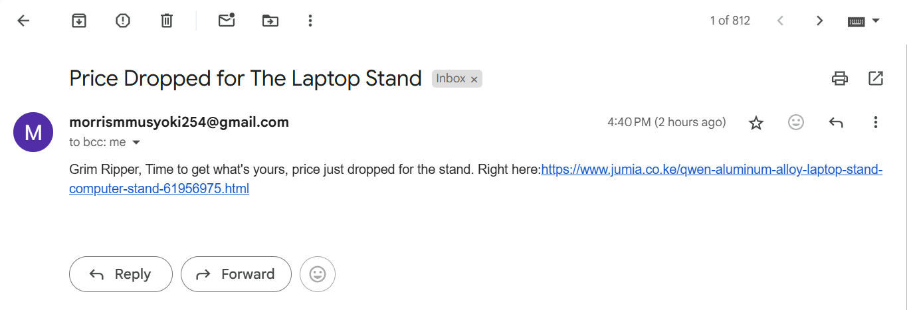

# Laptop Stand Price Tracker

## Project Overview
This is a Python script designed to monitor the price of a specific ***laptop stand product*** on Jumia (a popular e-commerce platform in Kenya) and send an email notification when the price drops below a certain threshold. The script uses web scraping to extract price data, handles basic error scenarios, and automates price checking at regular intervals. This project demonstrates skills in web scraping, automation, email notification systems, and basic Python programming.

## Features

- Scrapes price data from a Jumia product page using requests and BeautifulSoup.
- Converts the scraped price into a numerical value for comparison.
- Sends an email notification via SMTP when the price falls below or equal to 500 KSh.
- Continuously monitors the price every 24 hours (86,400 seconds) using a while loop and time.sleep().

## Technologies used
- Python 3.x: The primary programming language.
- Libraries:
  - ***requests:*** For making HTTP requests to the Jumia website.
  - ***BeautifulSoup4:*** For parsing HTML and extracting price data.
  - ***datetime:*** For handling date and time (though not currently utilized in the final code).
  - ***time:*** For pausing execution between price checks.
  - ***smtplib:*** For sending email notifications via Gmail’s SMTP server.
```python
import requests
from bs4 import BeautifulSoup
import time
import datetime
import smtplib
```
- Tools:
  - Web scraping tools for data extraction.
  - Basic error handling and logging (implicit in the structure).

# Code Structure
The script consists of two main functions:
1. ***check_price()***: Scrapes the Jumia product page, extracts the discounted price, converts it to a float, and returns it.
```python
# Scrapes the price of a laptop stand from Jumia Kenya website and returns the current discounted price as a float
def check_price():
    url = 'https://www.jumia.co.ke/qwen-aluminum-alloy-laptop-stand-computer-stand-61956975.html'
    
    # Set user agent to mimic a browser request and avoid being blocked
    headers = {'User-Agent': "Mozilla/5.0 (Windows NT 10.0; Win64; x64) AppleWebKit/537.36 (KHTML, like Gecko) Chrome/134.0.0.0 Safari/537.36"}
    page = requests.get(url, headers=headers)
    soup = BeautifulSoup(page.content, "html.parser")

    # Extract product details using CSS selectors
    title = soup.find('h1', class_='-fs20 -pts -pbxs').get_text()
    discounted_price = soup.find('span', class_='-b -ubpt -tal -fs24 -prxs').get_text()
    initial_price = soup.find('span', class_='-tal -gy5 -lthr -fs16 -pvxs -ubpt').get_text()
    discount = soup.find('span', class_='bdg _dsct _dyn -mls').get_text()
    
    final_price = float (discounted_price[3:])
    return final_price
```
2. ***send_email()***: Sets up an SMTP connection with Gmail, logs in, and sends an email notification when the price threshold is met.
```python
# Sends an email notification when the price drops below the target threshold. Uses Gmail's SMTP server to send the email.
def send_email():
    server = smtplib.SMTP_SSL('smtp.gmail.com', 465) # Connect to Gmail's SMTP server using SSL
    server.ehlo()
    server.login('morrismmusyoki254@gmail.com','yourpassword')
    
    subject = "Price Dropped for The Laptop Stand"
    body = "Grim Ripper, Time to get what's yours, price just dropped for the stand. Right here:https://www.jumia.co.ke/qwen-aluminum-alloy-laptop-stand-computer-stand-61956975.html"
   
    # Format the email with subject and body
    msg = f"Subject: {subject}\n\n{body}"
    
    server.sendmail(
        'GrimRipper@gmail.com',
        "morrismmusyoki254@gmail.com",
        msg
      )

    print("mail sent!!")
    server.quit()
```
The main program flow calls ***check_price()*** to get the current price, checks if it’s below or equal to 500, and sends an email if true. It then enters an infinite loop to check the price every 24 hours as shown below;
```python
# Call check_price() and store the result
final_price = check_price()

if (final_price <= 500):
    send_email()

# Continuous monitoring loop
while(True):
        check_price()
        time.sleep(86400)
```
# Possible Output
If the condition above is achieved and the price of the Laptop Stand is less than KSh 500 we'll get the following email.

# Limitations and Risks
1. Web Scraping Risks: The Jumia website may change its HTML structure, breaking the scraping logic (e.g., class names or element IDs). The script uses hardcoded CSS classes, which could fail if the website updates.
2. Email Security: The Gmail password is hardcoded, which is insecure. For production use, use environment variables, a configuration file, or OAuth2.
3. Rate Limiting: Continuously hitting the website every 24 hours might violate Jumia’s terms of service or trigger rate-limiting/blocking. Consider adding more robust error handling or respecting robots.txt.
4. No Error Handling: The current code lacks try-except blocks for network errors, parsing failures, or email sending failures.
5. Single Product: The script only tracks one product. To scale, you’d need to make it more flexible (e.g., accept multiple URLs or products).

# Future Improvements
- Add error handling for network failures, parsing errors, and email sending issues.
- Implement logging to track price changes over time (e.g., save to a file or database).
- Use environment variables or a secure configuration file for email credentials.
- Add scheduling with a library like ***schedule*** or ***apscheduler*** instead of an infinite while loop.
- Expand to track multiple products or e-commerce sites.

# Contributing
If you’d like to contribute to this project, feel free to fork the repository, make improvements (e.g., addressing the limitations above), and submit a pull request. Issues and feature requests are also welcome.

# Contact
  Created by: Morris Musyoki |
              | +2547 950 6559 |
              | morrismmusyoki254@gmail.com |
  
# Acknowledgments
+ Thanks to the developers of ***requests***, ***BeautifulSoup***, and other open-source libraries used in this project.
+ Inspiration drawn from e-commerce price tracking needs and personal interest in automation.


